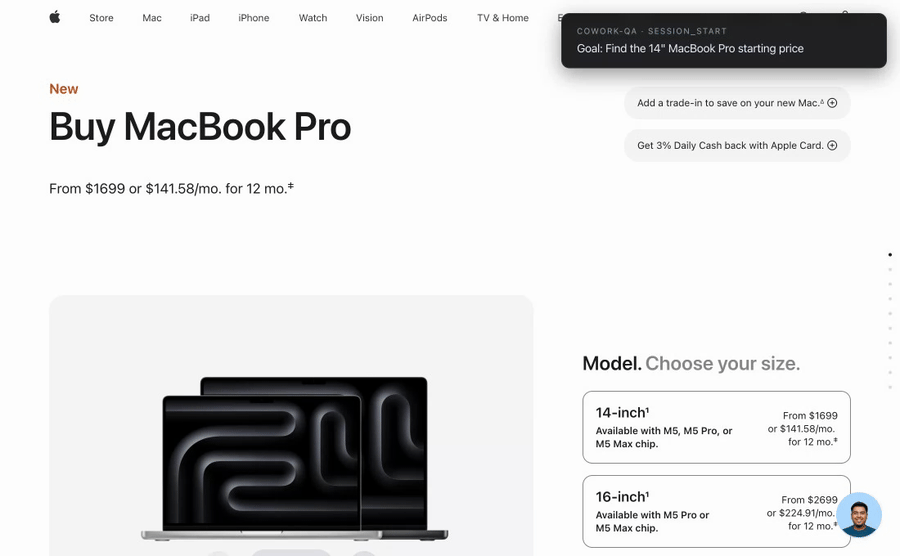

# cowork-qa-mcp



A [Model Context Protocol](https://modelcontextprotocol.io) server that gives an LLM a real Chromium browser, records every action it takes toward a stated goal, and hands back a structured trace so the LLM (or a second LLM) can decide whether the goal was actually achieved.

Built on [Playwright](https://playwright.dev). Five tools, one binary, no cloud dependency.

## Why

Most browser-tool MCP servers are stateless — the LLM clicks, gets HTML back, repeats. There's no record of what happened, no way to grade the run after the fact, and no goal context.

`cowork-qa-mcp` flips that:

- Every session **starts with a goal in plain English**.
- Every action (`goto`, `click`, `fill`, `press`, `eval`) is **recorded with timestamps, the URL after, and the page's aria-snapshot**.
- When the session ends, a JSON trace is persisted to disk and exposed via a single `qa_get_trace` call.

The orchestrating LLM can then reason over the trace ("did this run actually fulfill the goal, or did it click the wrong button?") instead of trusting the run-time chatter.

## Tools

| Tool | What it does |
|---|---|
| `session_start` | Open a fresh tab, optional starting URL, return a session id |
| `session_act` | Run one of: `goto`, `click`, `fill`, `press`, `eval`. Records the step. |
| `session_observe` | Return current URL + full aria-snapshot of the page |
| `session_end` | Close the tab, persist the trace to disk, return the file path |
| `qa_get_trace` | Return the goal, every step, final URL, and final aria-snapshot — formatted for an LLM to read |

## Install

Requires Node 20+. The package is on npm — no clone needed.

```bash
# Try it once, no install
npx cowork-qa-mcp

# Or install globally
npm install -g cowork-qa-mcp
```

The first install pulls Chromium via Playwright's `postinstall` (~150 MB).

## Wire into your MCP-compatible client

### Claude Code

```bash
claude mcp add cowork-qa --scope user -- npx -y cowork-qa-mcp
```

To watch the browser instead of running headless:

```bash
claude mcp add cowork-qa --scope user \
  -e COWORK_QA_HEADED=1 \
  -- npx -y cowork-qa-mcp
```

Verify with `/mcp` inside a fresh `claude` session — you should see `cowork-qa ✓ connected` and 5 tools.

### Claude Desktop

Add to `~/Library/Application Support/Claude/claude_desktop_config.json` (macOS) or `%APPDATA%\Claude\claude_desktop_config.json` (Windows):

```json
{
  "mcpServers": {
    "cowork-qa": {
      "command": "npx",
      "args": ["-y", "cowork-qa-mcp"]
    }
  }
}
```

### Cursor / Windsurf / other MCP clients

Any client that speaks the MCP stdio transport works. Point its server config at `npx -y cowork-qa-mcp`.

### From source (for development)

```bash
git clone https://github.com/inSideos-designs/cowork-qa-mcp.git
cd cowork-qa-mcp
npm install
npm run build
node dist/server.js   # stdio server, expects an MCP client
```

### MCP Registry

This server is also published on the official [MCP Server Registry](https://registry.modelcontextprotocol.io) as `io.github.inSideos-designs/cowork-qa` — clients that auto-discover from the registry will find it without any manual config.

## Environment variables

| Variable | Default | Purpose |
|---|---|---|
| `COWORK_QA_HEADED` | unset (headless) | Set to `1` to launch Chromium with a visible window |
| `COWORK_QA_DATA` | `<cwd>/.cowork-qa` | Directory where `<session-id>.json` traces are written |

## Usage example

A typical end-to-end loop the orchestrating LLM runs:

```
session_start({ goal: "find the cheapest 14\" MacBook Pro on apple.com",
                url: "https://www.apple.com/shop/buy-mac/macbook-pro" })
  → { session_id: "abc-123" }

session_observe({ session_id: "abc-123" })
  → URL + aria-snapshot

session_act({ session_id: "abc-123", action: "click",
              target: "button:has-text('Continue')" })

# ... more acts / observes ...

session_end({ session_id: "abc-123" })
  → { steps: 7, trace_path: "~/.cowork-qa/abc-123.json" }

qa_get_trace({ session_id: "abc-123" })
  → Goal: ...
    Steps (7 total): ...
    Final URL: ...
    Final aria-snapshot: ...
```

## Trace format

Each trace is a JSON file:

```json
{
  "session_id": "abc-123",
  "goal": "...",
  "steps": [
    {
      "t": 142,
      "action": "click",
      "args": { "target": "...", "value": null },
      "url_after": "...",
      "aria_after": "..."
    }
  ],
  "final": { "url": "...", "aria": "..." },
  "path": "/.../abc-123.json"
}
```

## Limitations / known quirks

- `session_observe` calls **don't show up in the trace's step count** — only `session_act` calls do. The final aria-snapshot is captured at `session_end`.
- `eval` runs the JS expression but **doesn't return the value to the caller** — only side effects on the page are observable.
- One Chromium process is shared across all sessions in a server instance; each session gets its own context (cookies, etc. are isolated).
- Selectors are passed straight to Playwright. CSS, text-selectors (`button:has-text("Send")`), and `role=` selectors all work.

## License

MIT — see [LICENSE](LICENSE).

## Contributing

PRs welcome. Keep it small: this is meant to stay a thin, auditable server.
